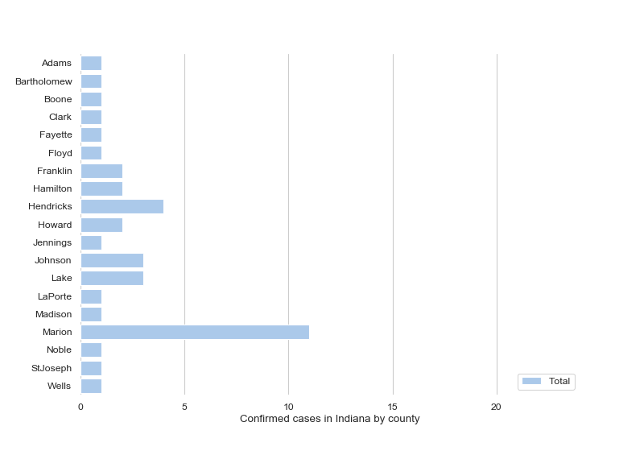

<h1> Indiana Covid19 </h1>

    
### Purpose
To visualize the spread of covid19 for Indiana using different parameters such as dates, counties, age, sex (dependent on the data
    
Notable TODOs:
- Scrape ISDH website instead of manually updating CSV
- Find age,and sex data

### Results
TBD

## Setup
Library import
We import all the required Python libraries
 
### Data manipulation
`import pandas as pd`

`import numpy as np`

### Visualizations
`import matplotlib.pyplot as plt`

`import seaborn as sns`

### Data import
For now the data is gathered by manually updating the CSV file daily using the ISDH website
 
#### References
1. Indiana State Department of Health(https://www.in.gov/coronavirus/)
